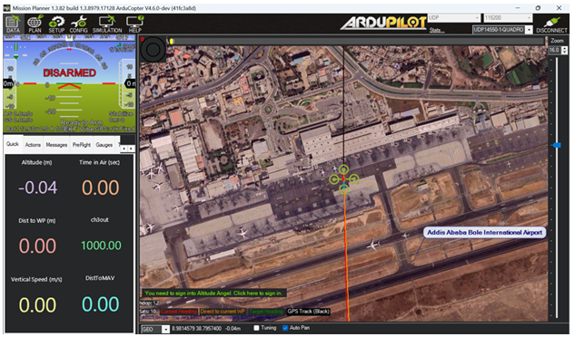

# ArduPilot SITL Docker Environment

This is a preconfigured Docker image that runs ArduCopter's Software-in-the-Loop (SITL) simulator (version **v4.6.0-dev**).

It starts at **Bole International Airport (Addis Ababa)** and includes **DroneKit**, **MAVProxy**, and all required dependencies.  
You can connect using Mission Planner or write your own mission scripts using DroneKit-Python.

---

## Default Launch Location

- **Location**: Bole International Airport (Addis Ababa, Ethiopia)  
- **Coordinates**: `8.981458°, 38.795740°`

This can be modified as needed.

---

## What's Included

- ArduCopter v4.6.0-dev
- DroneKit-Python 2.9.2
- MAVProxy + pymavlink
- Ubuntu 20.04 base

---

## Quick Start

### 1. Clone and Build
```bash
git clone https://github.com/surafelanshebo/ardupilot-sitl-docker.git
cd ardupilot-sitl-docker
docker build --no-cache -t sitl .
```

### 2. Run the Simulator
```bash
docker run --rm -it -p 14550:14550/udp sitl 
cd ardupilot
Tools/autotest/sim_vehicle.py -v ArduCopter -L Bole --console --map --out=udp:host.docker.internal:14550
```

Mission Planner will automatically connect on UDP port **14550**.  
Open Mission Planner and you should see the drone appear on the map centered at **Bole International Airport**.

---

## Mission Planner Connection

When connected, Mission Planner will show the map like this:

  
*Mission Planner showing SITL connection at Bole Airport*

---

## DroneKit Example

```python3
from dronekit import connect
vehicle = connect('udp:127.0.0.1:14550', wait_ready=True)
print("Connected to vehicle")
```

---
